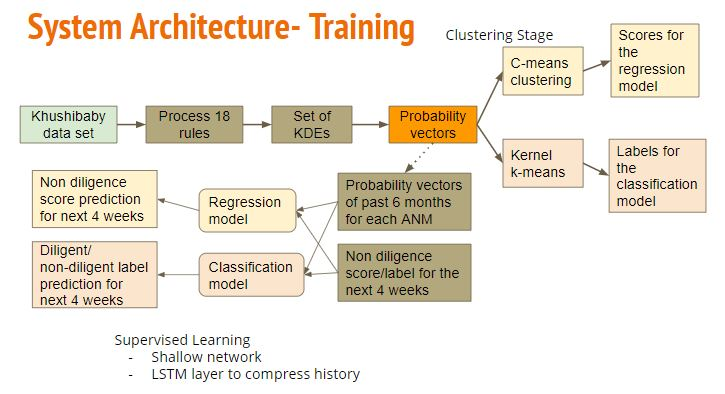
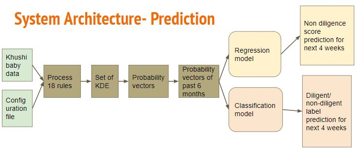
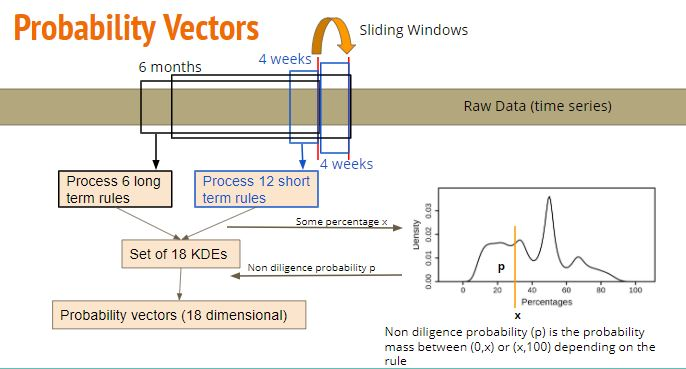
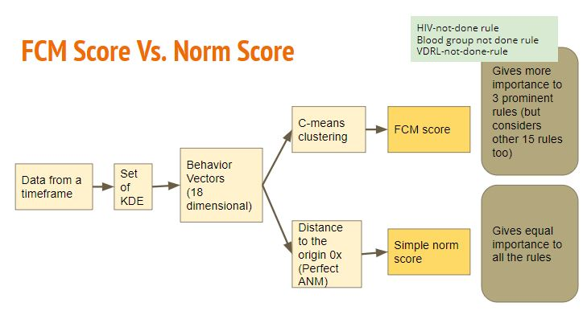
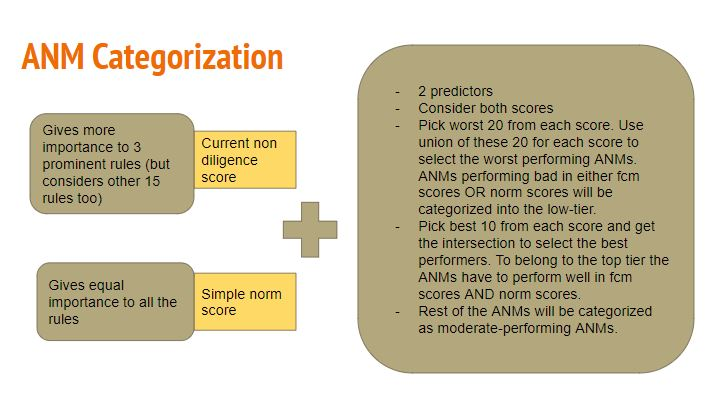

# Healthworker Diligence Prediction System

The poor quality of health data collected in low resource communities is a big hindrance for application of machine learning techniques in improving general health. 
Here, we define a data collection quality score for each health worker who collects data. 
This challenging unlabeled data problem is handled by building upon human guidance to design a useful data representation that is then clustered to infer data quality labels or a score. 
We also provide a more interpretable version of the score.
This score already provides for a measurement of data collection quality; in addition we also predict the quality for future time steps.

For more details please refer our full paper - available [here](https://arxiv.org/pdf/2011.02962.pdf)

## System Architecture Diagrams

### How the probability vectors are obtained

### 2 types of non-diligence scores

### Categorization of ANMs into 3 tiers

### Documentation

Please find the main documentation [here](./docs/README.md)