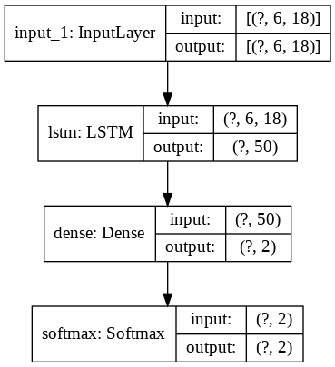
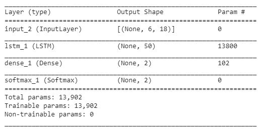

## Model

We have used a shallow neural network to predict the non-diligence scores of health workers.
This model is a regression model with a LSTM layer followed by a dense layer. The LSTM layer is used to compress the history of non-diligence vectors of 6 months, which are given as inputs to the model.

> regression_model: Trained model (using TensorFlow 2.3.0)

#### Neural network architecture

#### Neural network summary

> Main documentation [link](../docs/README.md)